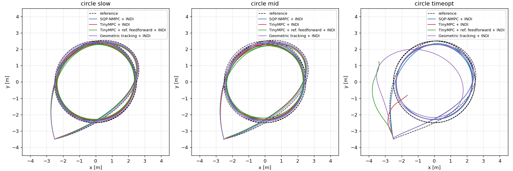
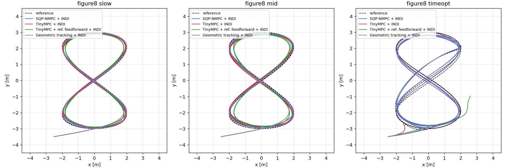
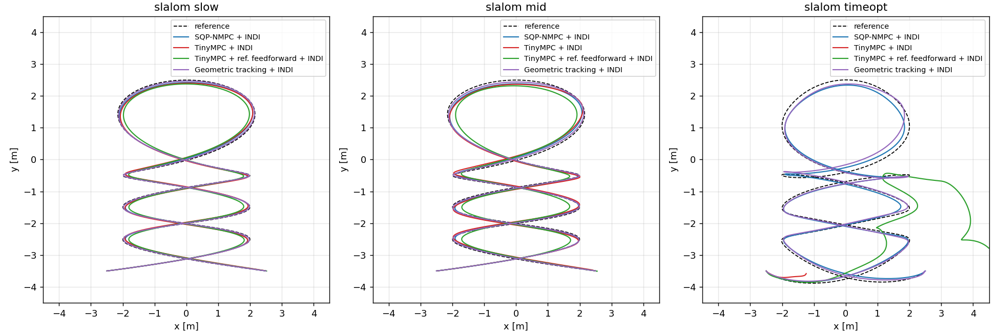
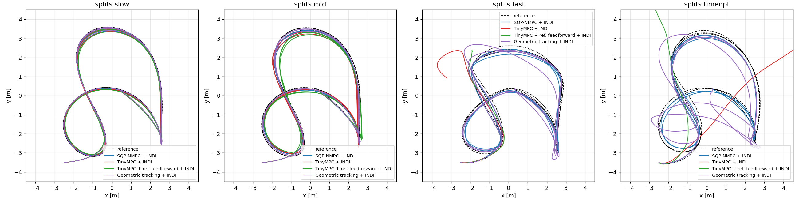

# TinyMPC, geometric tracking and SQP-NMPC on the indoor missions

Rust port of [TinyMPC](https://github.com/TinyMPC/TinyMPC) (Nguyen et al.,
ICRA 2024 — `tmp/TinyMPC.pdf`) added as a second outer-loop solver and
compared against the firmware's SQP-NMPC (`cybflight_core::mpc::QuadModel`
+ `SimpleSqpSolver`) in the host sim on all 13 indoor missions.

## What was added

| Piece | Where |
|---|---|
| ADMM solver with cached infinite-horizon LQR (`TinyMpc`, `TinyCache`, `TinySettings`), `no_std`, const-generic `<NX, NU, N>` | `crates/cybflight_core/src/mpc/tinympc.rs` |
| Hover-linearised 9-state quadrotor `(A, B)` — exact ZOH of `QuadModel` about hover, same inputs `[thrust, ωx, ωy, ωz]` | `tinympc::hover_linear_model` |
| `TinyMpcIndiController` — TinyMPC + the **same** INDI inner loop and reference chain as `MpcIndiController`; optional `reference_feedforward` | `crates/cybflight_sim/src/controller.rs` |
| `MpcIndiController` fidelity switches: SQP solve rate, INDI rate, horizon `n` (`with_options`), `use_tilt_map`, `flatness_feedforward`, `attach_position_sampler` — the firmware's reference chain, off by default so the regression snapshot is unchanged | `crates/cybflight_sim/src/controller.rs` |
| `Setpoint.jerk` (from the MINCO polynomial) for the flatness feedforward | `crates/cybflight_sim/src/trajectory.rs` |
| Runtime SQP horizon: `SqpSolver::solve` runs `problem.n ≤ N` stages inside the const-generic workspace (byte-identical when `n == N`, the firmware case) | `crates/cybflight_core/src/mpc/sqp_solver.rs`, `mpc_problem.rs` |
| `GeometricTrackingController` — port of the RPG `position_controller` (Faessler et al. RA-L 2018, rate mode, no aero compensation): saturated PD position law, flatness feedforward (ω, ω̇ from jerk/snap), tilt-prioritised attitude feedback → (thrust, body rates) | `crates/cybflight_core/src/attitude_control/geometric_controller.rs` |
| `GeometricIndiController` — the geometric law at 500 Hz + the shared INDI loop; gains tuned in `sweep_geometric` / `sweep_geometric_fine` | `crates/cybflight_sim/src/controller.rs` |
| `--controller tinympc-indi`, `--controller geometric-indi` | `sim-run` CLI |
| Comparison harness, ablation, plots | `crates/cybflight_sim/tests/figure8_tinympc_compare.rs`, `analysis/plot_figure8_compare.py`, `just sim-figure8-compare` |

The port follows `src/tinympc/admm.cpp` step for step (backward pass with
`C1`/`C2`, forward rollout with `K∞`, slack projection, dual update, linear-cost
refresh with `Q̃ = Q + ρI`, `P∞` at the terminal knot, residual check every
`check_termination` iterations). Two documented deviations: the linear cost is
refreshed once before the first ADMM iteration so it sees the current
reference, and the Riccati iteration stops on a `‖ΔK‖∞` tolerance.

### How the reference implementation sets dt (fact-checked against the repos)

There is no runtime `dt` in TinyMPC: `(A, B, K∞, P∞)` are generated offline
and the sampling period is baked into `A` and the file name —
`quadrotor_{20,50,100}hz_params.hpp` in the main repo have `A[0,6]` (x ← vₓ)
= 0.05 / 0.02 / 0.01 s, ρ = 5. The Crazyflie firmware that flew the paper's
figure-8 (`RoboticExplorationLab/tinympc-crazyflie-firmware`,
`controller_tinympc.c`) has `#define DT 0.002f`, `MPC_RATE RATE_500_HZ`,
`params_500hz.h` and advances the reference one column per tick — i.e.
**dt = 1 / f_MPC, horizon knots at the control period**. The paper (§V-C)
states N = 15 at 500 Hz for the figure-eight; the checked-in firmware
snapshot (last commit June 2023, before the paper's experiments) carries
`NHORIZON 5`, ρ = 250 — the paper is taken as authoritative for what flew.

## Sim vs. reality: why the SQP flipped in sim but flies time-optimal missions

The leader flies the time-optimal missions on hardware
(`analysis/datasets/indoor_exp_timeopt/exp_{circle,slalom,splits}_timeopt.mcap`,
CSVs = the planner's reference at 100 Hz). From `/odometry` between
`MISSION_EXECUTING` and `MISSION_IDLE`:

| flight | mission window | temporal RMS / peak | geometric RMS / peak | flown v_max | flown tilt_max | reference demand |
|---|---|---|---|---|---|---|
| circle timeopt | 5.10 s (ref 5.01) | 1.20 / 1.55 m | 0.28 / 0.53 m | 12.4 m/s | 117° | 13.6 m/s, 106°, 11.7 rad/s |
| slalom timeopt | 6.14 s (ref 6.14) | 0.63 / 1.18 m | 0.27 / 0.62 m | 10.2 m/s | 121° | 11.1 m/s, 113°, z_min 0.39 |
| splits timeopt | 8.83 s (ref 8.73) | 1.00 / 1.58 m | 0.28 / 0.58 m | 11.9 m/s | 124° | 13.2 m/s, 130°, 11.7 rad/s |

So "follows the trajectory" means: stays on the **path** within ~0.3 m RMS
/ 0.6 m peak and never flips, while running ~1 m (≈ 0.1 s at 10 m/s —
exactly `sampler_max_lag_s`) **behind** the time schedule. The reference
demand itself is identical to the sim's MINCO refit (106–130° tilt,
11–14 m/s), so the reference is not the discrepancy.

The frozen sim `MpcIndiController` omitted three things the firmware's
`outer_loop.rs` does, and the leader YAML has one thrust-curve gap:

1. **Flatness `u_ref` feedforward** (`USE_FLATNESS_U_REF_FEEDFORWARD =
   true`): `u_refs[k] = [m·‖α‖, ω_body]` from `flatness_to_thrust_omega(acc,
   jerk)`. The sim biased every input to hover.
2. **Tilt-yaw `q_ref`** (`flatness_map: tilt_yaw`, `quaternion_from_zb_and_yaw`);
   the sim used the cross-product map, singular at 90° tilt.
3. **Position sampler** (`sampler_kind: 1`, `max_lag/max_lead 0.1 s`,
   the pairing the contouring cost requires); the sim fed a time-indexed
   horizon.
4. Leader YAML leaves `m*_nonlin` at the 0 sentinel → sim INDI inverts
   k = 0.025 against the plant's k = 0.95 (sim_baseline pins 0.8).

Ablation (`sqp_fidelity_ablation`, SQP 100 Hz / N = 20, INDI 1 kHz),
geometric RMS / peak [m], temporal RMS in parentheses, "✗" = flip + crash:

| mission | base | + tilt map | + feedforward | + sampler | tilt+ff+sampler | + nonlin fix |
|---|---|---|---|---|---|---|
| circle timeopt | 0.79 / 2.00 (1.51) | ✗ 1.31 s | **0.14 / 0.34** (0.21) | 1.04 / 2.47 (2.32) | 0.11 / 0.22 (0.50) | 0.61 / 1.61 (1.51) |
| figure8 timeopt | ✗ 2.33 s | ✗ 1.25 s | **0.12 / 0.24** (0.16) | 0.50 / 1.38 (1.76) | 0.11 / 0.22 (0.72) | ✗ 6.99 s |
| slalom timeopt | ✗ 4.87 s | 0.78 / 3.07 (1.88) | **0.09 / 0.25** (0.11) | 0.34 / 1.34 (1.12) | 0.08 / 0.22 (0.55) | 0.42 / 1.26 (1.57) |
| splits fast | 0.48 / 1.90 (0.93) | ✗ 1.74 s | **0.09 / 0.24** (0.17) | ✗ 1.67 s | 0.09 / 0.27 (0.62) | 0.24 / 1.06 (0.47) |
| splits timeopt | ✗ 2.63 s | ✗ 1.74 s | **0.18 / 0.39** (0.24) | 0.52 / 1.45 (1.78) | 0.12 / 0.26 (0.70) | 0.52 / 1.61 (1.14) |
| slow / mid (8 rows) | 0.04–0.11 | same | 0.04–0.10 | same geom, temporal ×3 | same geom, temporal ×3 | same |

**The feedforward is the whole story.** With `u_ref` from the flatness map
the SQP flies every fast/time-optimal mission in sim at 0.09–0.18 m
geometric RMS, peaking at the reference tilt (104–132°) instead of
flipping. Mechanism: with RTI (one Newton step per tick) and `u_ref =
hover`, the input cost pulls the single iterate toward hover thrust and
zero rates on a segment that needs 2–3 g and 10+ rad/s; the linearisation
about that iterate is then wrong at the pole (the tilt → thrust-loss
coupling) and the step overshoots into a flip. The feedforward moves the
linearisation point onto the differential-flatness solution, so the SQP
only corrects model error and disturbance. The tilt map alone is neutral
or worse (it changes where the singular attitude reference falls but not
the fact that the iterate is far from it); the nonlin fix is neutral; the
position sampler on its own cannot rescue an iterate that is already
wrong. The sampler's effect is to accept lag: geometric error unchanged,
temporal RMS ×3 (0.4–0.7 m) — which is what the real flights show
(temporal 0.6–1.2 m vs geometric 0.27 m).

With all three (the flown configuration) the sim reproduces the flights'
character: geometric 0.08–0.12 m (flights 0.27–0.28 m; the sim has perfect
state, no mocap dropouts — the flights log several `ESTIMATOR_DOWN/UP`
events mid-mission — and an analytic thrust model), temporal 0.5–0.7 m
(flights 0.6–1.2 m), peak tilt 101–131° (flights 117–124°).

## Setup

**Vehicle — `vehicles/sakura_bench_leader_1khz.yaml`**, used unchanged for
the plant and both controllers: 0.6 kg, 4 × 10 N (40 N ceiling, `thrust_frac
0.75` → 30 N usable), inertia `diag(2.0, 1.8, 3.8)·10⁻³`, `max_rate
[10, 10, 6]` rad/s, motor τ = 20 ms, INDI rate gains 80 / sync 30 Hz. The
leader YAML has no `sim:` section, so the plant takes rotor drag, ESC idle
floor and throttle curvature from `vehicles/sim_baseline.yaml`. INDI runs at
**1 kHz** for all stacks (8 × 125 µs plant substeps per tick); the sim uses
the analytic quadratic thrust model where the leader flies the `a2rl_0114`
table.

**SQP-NMPC (`mpc_indi`) — firmware-faithful**: the leader's flown tune
(contouring cost `w_pos = [500, 500, 200]`, `w_vel = 10`, `w_att = [50, 50,
200]`, `w_thrust = 1`, N = 20 × 50 ms, RTI at **100 Hz**, cubic input
penalty `rho = 1e4`, tilt fence 178° / τ 0.5) **with** tilt-yaw `q_ref`,
flatness `u_ref` feedforward and the position sampler
(`sampler_max_lag_s = max_lead_s = 0.1`, radius 0.15 m).

**TinyMPC (`tinympc_indi`)** — the paper's figure-eight configuration and
the reference implementation's conventions: **500 Hz, N = 15, dt = 2 ms**
(30 ms horizon), hover-linearised model with a 3-parameter attitude error,
ρ = 5, library-default ADMM settings (≤ 100 iterations, tolerances 1e-3),
input box constraints on hover-relative thrust `[−mg, 30 − mg] N` and body
rates `±[10, 10, 6]`, state bounds off, `u_ref = 0`; `Q = diag(500, 500,
200, 50, 50, 200, 10, 10, 10)`, `R = 1·I` (the leader's weights). It
commands (thrust, body rates) into the same INDI loop as the SQP.
**`tinympc_ff_indi`** is the same solver with `u_ref` = reference thrust
`m·‖α‖` and the body rate between consecutive `q_ref` knots — the
linear-MPC counterpart of the SQP's feedforward. Neither variant uses the
position sampler (TinyMPC's fixed-dt formulation samples its reference
at the control period, as in the reference implementation).

**Geometric tracking (`geometric_indi`)** — port of
`uzh-rpg/rpg_quadrotor_control/control/position_controller`
(`use_rate_mode: true`, `perform_aerodynamics_compensation: false`):
`a_des = Kp·sat(e_p) + Kd·sat(e_v) + a_ref + g ẑ`, thrust `= m·max(a_des·z_B,
1)`, desired attitude from `z_B = a_des/‖a_des‖` and the heading frame with
the robust x_B fallback, feedforward body rates / angular accelerations from
(a_ref, j_ref, s_ref) by flatness inversion, tilt-prioritised feedback
`ω_fb = 2·diag(k_rp, k_rp, k_yaw)·sgn(q_e.w)·vec(q_e)`; command `[m·c,
ω_ff + ω_fb]` clamped to the same thrust/rate bounds as the MPCs, solved at
**500 Hz**. Gains tuned for the leader on figure8 slow/mid/timeopt + splits
mid/fast (108-point grid then a 36-point refinement, ranked by geometric
RMS): **kpxy 32, kdxy 12, kpz 48, kdz 18, krp 20, kyaw 5**, saturations
2 m / 4 m/s (xy), 1 m / 3 m/s (z). That is ω_n = 5.7 rad/s, ζ ≈ 1.06,
3.5× below the 20 rad/s attitude loop — the sweep was stopped there rather
than let perfect-state sim reward unbounded stiffness. The reference
`default.yaml` (10 / 4 / 15 / 6, krp 12, 0.6 m / 1 m/s saturations)
completes the same missions at 2–3× the error; the tight saturations cost
most on the fast profiles.

**Missions** — every `missions/indoor_*.yaml`, MINCO refit at the mission
timestamps (the plan the firmware bakes), yaw 0, perfect IMU / rotor
telemetry, plant truth as state, 8 kHz plant. Reference demand after refit
(`demand_probe`): slow ≤ 48° tilt / ≤ 5.8 m/s; mid 63–76° / 6–8 m/s;
fast 71° / 11.3 m/s / 13.7 rad/s; timeopt 103–130° / 11–14 m/s.

## Results

`just sim-figure8-compare` (2026-08-26). **temporal** = `‖p(t) − p_ref(t)‖`
against the time-indexed reference; **geometric** = distance to the closest
point on the reference path (timing-independent). RMS / peak [m]; "✗ t" =
flip and crash at t. Full table incl. terminal error and saturation:
`target/sim-out/figure8_tinympc/summary.md`.

| mission | SQP-NMPC (flown config) geometric | temporal | Geometric tracking (tuned) geometric | temporal | TinyMPC (paper) geometric | temporal | TinyMPC + feedforward geometric | temporal |
|---|---|---|---|---|---|---|---|---|
| circle slow | 0.066 / 0.130 | 0.486 | **0.031 / 0.055** | 0.052 | 0.112 / 0.190 | 0.152 | 0.213 / 0.329 | 0.255 |
| circle mid | 0.086 / 0.172 | 0.561 | **0.049 / 0.095** | 0.071 | 0.206 / 0.320 | 0.228 | 0.463 / 0.687 | 0.484 |
| circle timeopt | **0.112 / 0.218** | 0.498 | 0.291 / 1.117 (122° tilt) | 0.642 | ✗ 0.65 s | — | ✗ 0.82 s | — |
| figure8 slow | 0.050 / 0.111 | 0.422 | **0.019 / 0.038** | 0.039 | 0.082 / 0.160 | 0.118 | 0.166 / 0.279 | 0.219 |
| figure8 mid | 0.067 / 0.127 | 0.507 | **0.030 / 0.065** | 0.050 | 0.168 / 0.277 | 0.186 | 0.373 / 0.549 | 0.409 |
| figure8 timeopt | 0.107 / 0.220 | 0.724 | **0.078 / 0.171** | 0.119 | ✗ 0.55 s | — | ✗ 0.95 s | — |
| slalom slow | 0.039 / 0.084 | 0.316 | **0.015 / 0.039** | 0.026 | 0.067 / 0.138 | 0.085 | 0.143 / 0.293 | 0.188 |
| slalom mid | 0.049 / 0.116 | 0.388 | **0.023 / 0.064** | 0.031 | 0.140 / 0.266 | 0.150 | 0.323 / 0.541 | 0.367 |
| slalom timeopt | **0.082 / 0.216** | 0.553 | 0.086 / 0.341 | 0.106 | ✗ 0.52 s | — | ✗ 3.16 s | — |
| splits slow | 0.040 / 0.093 | 0.405 | **0.015 / 0.029** | 0.036 | 0.051 / 0.110 | 0.108 | 0.092 / 0.182 | 0.151 |
| splits mid | 0.073 / 0.148 | 0.539 | **0.036 / 0.077** | 0.055 | 0.164 / 0.276 | 0.194 | 0.350 / 0.614 | 0.409 |
| splits fast | **0.092 / 0.271** | 0.619 | 0.187 / 0.894 (flip, recovers) | 0.399 | ✗ 2.04 s | — | ✗ 1.74 s | — |
| splits timeopt | **0.119 / 0.258** | 0.697 | 0.407 / 1.224 (149° tilt) | 0.769 | ✗ 1.55 s | — | ✗ 2.14 s | — |

| | |
|---|---|
|  |  |
|  |  |

Error-vs-time plots are not committed; `analysis/plot_figure8_compare.py`
regenerates them (`<family>_errors.png`). The per-mission XY plots
(`img/tinympc_xy/`) are kept only in git tag `archive/0908_learned_cost`.

### Reading the numbers

- **Geometric error is the metric that matches how the missions are flown
  and scored.** The SQP's contouring cost + position sampler deliberately
  trade along-path lag (temporal RMS 0.3–0.7 m, ≈ the 0.1 s sampler lag at
  mission speed) for corridor accuracy; its temporal number is a design
  choice, not tracking error, and it is the same trade the real flights
  show.
- **Slow and mid profiles (≤ 76° tilt):** the tuned geometric tracking
  controller is the most accurate stack on all eight — 0.015–0.05 m
  geometric RMS, about half the flown SQP's 0.04–0.09 m — with essentially
  no lag (temporal ≈ geometric): a stiff PD law with exact flatness
  feedforward on perfect state and a 1 kHz INDI inner loop is hard to beat
  inside its saturation envelope, and unlike the SQP it does not trade lag
  for corridor accuracy. Paper-configured TinyMPC is 1.3–2.9× worse than the
  SQP (0.05–0.21 m) and overshoots tilt on the mid profiles (66–106°).
- **Fast / time-optimal profiles (71–130° reference tilt, 11–14 m/s):** the
  flown SQP completes all five at 0.08–0.12 m geometric RMS, peaking at the
  reference tilt. The geometric controller also completes all five but with
  0.9–1.2 m excursions on circle timeopt, splits fast (a flip it recovers
  from, 170° tilt) and splits timeopt (0.19–0.41 m RMS); only on the
  figure-8 and slalom timeopt profiles does it match the SQP. Its error
  saturations (2 m / 4 m/s) are what keep it upright there — the reference
  tight saturations flip on splits fast — but a PD law reacting to error has
  no preview of the 12 rad/s, >90° segments the MINCO refit demands, whereas
  the SQP's 1 s horizon anticipates them. TinyMPC crashes on all five within
  0.5–2 s — a fixed hover linearisation has no useful model past ~90° tilt
  regardless of cadence or ρ.
- **Feedforward helps the SQP and hurts TinyMPC.** For the SQP it is the
  difference between flipping and flying (ablation above). For TinyMPC,
  `u_ref` from the reference biases the ADMM solution toward thrusts and
  rates the linear model cannot reconcile with its own prediction:
  geometric error doubles on slow/mid and the fast profiles still crash.
  (At ρ = 1 the feedforward variant is competitive on figure8 mid,
  `sweep_tinympc` — the paper's ρ = 5 is kept here.)
- **Cadence and inner-loop rate barely matter for the SQP**: 100/200/500 Hz
  solves and 500 Hz / 1 kHz / 8 kHz INDI move slow/mid by < 2 mm. TinyMPC
  is sensitive to horizon *duration* (30 ms best; 1 s flips on mid).

**Bottom line:** once the sim SQP carries the firmware's reference chain
(flatness feedforward, tilt-yaw `q_ref`, position sampler) it flies every
indoor mission including the time-optimal ones, reproducing the real
flights' behaviour (path-accurate, ~0.1 s behind schedule, never flipping);
the earlier "both crash on timeopt" result was a sim-fidelity artefact of
the hover-biased `u_ref`. Against that faithful SQP, the tuned geometric
tracking controller is ~2× more path-accurate on the slow/mid profiles but
2–3× worse (with metre-scale excursions and one recovered flip) on three of
the five fast/time-optimal ones, and TinyMPC at the paper's settings is
1.3–2.9× less accurate than the SQP on slow/mid and cannot fly the
fast/time-optimal profiles at all.

## Reproducing

```sh
just sim-figure8-compare              # table + per-family / per-mission PNGs in target/sim-out/figure8_tinympc/
just sim-run CONTROLLER=tinympc-indi  # any scenario through the TinyMPC stack
cargo test -p cybflight-sim --target x86_64-unknown-linux-gnu --profile release-host \
    --test figure8_tinympc_compare -- --ignored --nocapture --test-threads=1   # demand probe, sweeps, fidelity ablation
```

TinyMPC is host-sim only for now: wiring it into the firmware outer loop
would be a new `outer_loop:` variant in `board_init`/`outer_loop.rs`
(the solver itself is `no_std` and checks on `thumbv7em-none-eabihf`).
